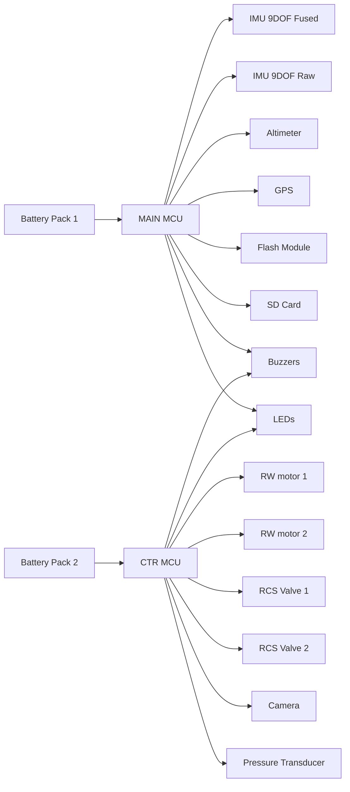

# Cubesat Final Architecture #

## Description ##
The system is based on two electrically identical battery packs providing full energy redundancy, operate two onboard computers with strictly separated roles, where the MAIN OBC performs all system-level functions including sensor acquisition (GPS, fused IMU, raw IMU and barometer), state estimation, data logging to flash and SD, communications, mode management, fault handling and distributes validated state information to the CTR OBC and Cameras. The CTR OBC is dedicated exclusively to real-time control and flight dynamics, generating actuator commands based on the received state without handling power or logging, resulting in a modular, fault-tolerant and safety-oriented architecture that cleanly separates system intelligence and control execution.

### Battery Packs Concept
The term battery packs refers to two electrically identical sets of batteries, equal in chemistry, capacity, nominal voltage, and performance envelope. These packs are designed to be interchangeable from an electrical standpoint. Both packs are actively used at any given time. However, it should be clarified that the energy flow will be controlled by different switches.

### General Elements

The system includes a **GPS receiver** used for absolute positioning, velocity estimation, and time reference. This provides global navigation data that complements inertial and barometric measurements and serves as a long-term correction source for state estimation algorithms.

Two inertial measurement units are incorporated with distinct roles. The first is an **IMU with integrated sensor fusion capabilities**, intended to provide a reliable, low-latency estimate of attitude and angular rates with minimal computational overhead. This fused output is primarily used for fast-loop control, initialization, and redundancy. In parallel, a second **IMU dedicated exclusively to raw sensor data acquisition** is included. This device provides unprocessed accelerometer, gyroscope and magnetometer measurements, enabling custom filtering, advanced state estimation, post-flight analysis, and algorithm validation independent of vendor-provided fusion.

A single **barometric pressure sensor** is used for altitude estimation and vertical rate computation. Its data complements inertial measurements and is especially relevant for low-frequency altitude tracking and apogee detection. The barometer is shared as a common input across estimation and logging subsystems.

For data persistence, the system integrates **non-volatile flash memory** to support continuous onboard data logging during flight. This storage is intended for high-reliability recording of critical sensor data, and system states. In addition, a **physical SD card slot** is included to allow retrieval of detailed flight data after recovery.

Finally, the system incorporates **LED indicators** and a **buzzer** to provide immediate visual and audible feedback regarding system states such as power-up, arming status, fault conditions, and mode transitions.

## Dual OBC Architecture

Battery protection is limited to passive hardware elements such as fuses, current limiters, and voltage regulators, but FDIR will be used for critical components.

The **Control OBC** (CTR OBC) is dedicated exclusively to running control algorithms and robust state estimation. It assumes that actuator power channels are available, and it outputs control signals accordingly. It does not perform power arbitration, logging, or sensor preprocessing. Its operation depends on receiving validated sensor data and system status from MAIN OBC.

The **Main OBC** (MAIN OBC) monitors battery voltages and currents and is responsible for all sensor interfacing and data handling. It acquires raw sensor data, processes and conditions it, runs secondary or complementary state estimation algorithms, and stores data for later retrieval. It also handles non-critical system services such as data logging, Bluetooth communication with an external application. It can issolate the power of the actuators in case of detecting faults on errors in the system. 

Communication between the two OBCs it's given through UART.

## Pin and Interface Budget

### MAIN OBC
| TYPE   | ITEM                       | PINS | COMMENTS |
|--------|----------------------------|------|----------|
| COM    | UART TX (CTR OBC)          | 1    | For communication with Control OBC |
| COM    | UART RX (CTR OBC)          | 1    | For communication with Control OBC |
| COM    | UART3 TX (GPS)             | 1    | For GPS module connection |
| COM    | UART3 RX (GPS)             | 1    | For GPS module connection |
| COM    | SDA I2C1                   | 1    | I2C1 bus definition |
| COM    | SCL I2C1                   | 1    | I2C1 bus definition |
| COM    | SDA I2C2                   | 1    | I2C2 bus definition |
| COM    | SCL I2C2                   | 1    | I2C2 bus definition |
| COM    | SCK SPI1                   | 1    | SPI1 bus definition|
| COM    | MOSI SPI1                  | 1    | SPI1 bus definition |
| COM    | MISO SPI1                  | 1    | SPI1 bus definition |
| COM    | SCK SPI2                   | 1    |SPI2 bus definition |
| COM    | MOSI SPI2                  | 1    |SPI2 bus definition |
| COM    | MISO SPI2                  | 1    | SPI2 bus definition|
| SENSOR | IMU 9DOF Fused             | 0    | Connected to I2C1     |
| SENSOR | IMU 9DOF Raw               | 0    | Connected to I2C2 |
| SENSOR | Altimeter                  | 0    | Connected to I2C1   |
| SENSOR | GPS                        | 0    | Connected to UART3    |
| SENSOR | Flash                      | 1    | Connected to SPI1     |
| SENSOR | SD Card                    | 1    | Connected to SPI2     |
| SENSOR | Pressure Transducer        | 1    | Connected to Analog pin      |
| OUTPUT | Buzzer                     | 1    | Connected to PWM      |
| OUTPUT | LEDs                       | 3    | Connected to PWM      |

### CTR OBC
| TYPE   | ITEM                         | PINS | COMMENTS |
|--------|------------------------------|------|----------|
| COM    | UART1 TX (MAIN OBC)          | 1    |          |
| COM    | UART1 RX (MAIN OBC)          | 1    |          |
| COM    | UART2 TX (CAM)               | 1    | For communication with Cameras Module |
| COM    | UART2 RX (CAM)               | 1    | For communication with Cameras Module |
| OUTPUT | Control CH1 (RW motor 1)     | 1    | PWM      |
| OUTPUT | Control CH2 (RW motor 2)     | 1    | PWM      |
| OUTPUT | Control CH3 (RCS Valve 1)    | 1    | PWM      |
| OUTPUT | Control CH4 (RCS Valve 2)    | 1    | PWM      |
| OUTPUT | Buzzer                       | 1    | PWM      |
| OUTPUT | LEDs                         | 3    | PWM      |

### Summary
| MCU      | UART | I2C | SPI | PWM  | Analog | Total Pins |
|----------|------|-----|-----|------|--------|------------|
| MAIN OBC | 3    | 2   | 2   | 2    | 1      | 23         |
| CTR OBC  | 1    | 0   | 0   | 8   | 0       | 10         |
---
*NOTE 1:* Main OBC shall include bluethoot capabilities \
*NOTE 2:* Control OBC shall be a control type MCU \
*NOTE 3:* Main OBC can use RTOS

## Power Budget
### CTR OBC
| ITEM                            | Operating Voltage (V) | Operating Consumption (mA) | Total Power Consumption (W) | Expected Operating Time (s) | Time Justification                          | Total Energy (Wh) |
| ------------------------------- | --------------------: | -------------------------: | --------------------------: | --------------------------: | ------------------------------------------- | --------------------: |
| MCU       |                 3.3 |                         80 |                         0.26 |                    720 | Control active only post-ejection |                      0.052 |
| Power Control CH1 (RW motor 1)  |                  12.0 |                        800 |                         9.6 |                    300 | Continuous roll stabilization post-ejection |          0.8 |
| Power Control CH2 (RW motor 2)  |                  12.0 |                        800 |                         9.6 |                    300 | Continuous roll stabilization post-ejection |          0.8 |
| Power Control CH3 (RCS Valve 1) |                  12.0 |                        640 |                         7.7 |                    300 | Intermittent roll corrections (~10% duty)   |          0.064 |
| Power Control CH4 (RCS Valve 2) |                  12.0 |                        640 |                         7.7 |                    300 | Intermittent roll corrections (~10% duty)   |          0.064 |
| Power Control (CAM)             |                   5.0 |                       1850 |                       9.25 |                    720 | Always ON post-ejection          |              1.85 |
| Pressure transducer             |                   5.0 |                       10 |                         0.05 |                    720 | Control active only post-ejection          |              0.01 |
| Buzzer                          |                   5.0 |                         50 |                         0.25 |                     60 | Distributed status beeps                    |           0.004 |
| LEDs (3×)                       |                   3.3 |                         60 |                         0.20 |                    720 | Continuous status indication                |           0.04 |

*NOTE:* Operating time based on the launch vehicle's descent rate approximation.

### Main OBC
| ITEM                 | Operating Voltage (V) | Operating Consumption (mA) | Total Power Consumption (W) | Expected Operating Time (s) | Time Justification                | Total Energy (Wh) |
| -------------------- | --------------------: | -------------------------: | --------------------------: | --------------------------: | --------------------------------- | --------------------: |
| MCU                  |                   3.3 |                        180 |                        0.60 |                    3600 | Always ON             |             0.60 |
| IMU 9DOF Fused       |                   3.3 |                         30 |                         0.10 |                     720 | Only useful post-ejection    |           0.02 |
| IMU 9DOF Raw         |                   3.3 |                         15 |                         0.05 |                    1800 | Launch detection + backup         |            0.025 |
| Altimeter            |                   3.3 |                          5 |                         0.017 |                    1800 | Launch, apogee, descent awareness |                0.0085 |
| GPS                  |                   3.3 |                         45 |                         0.15 |                     720 | Post-ejection navigation          |        0.03 |
| Flash                |                   3.3 |                         30 |                         0.10 |                    3600 | Primary flight data logger        |              0.10 |
| SD Card (active)     |                   3.3 |                        100 |                        0.33 |                      40 | Landing-only data dump            |          0.0037 |
| Buzzer               |                   5.0 |                         50 |                         0.25 |                      60 | Distributed status beeps          |            0.004 |
| LEDs (3×)            |                   3.3 |                         60 |                         0.20 |                    3600 | Continuous status indication      |            0.20 |

*NOTE:* Operating time based on the launch vehicle mission states to be taken into account. Subject to adjustments.

### Raw Summary
| CATEGORY                         | INCLUDED ELEMENTS                                                                                                   | Total Energy (Wh) | COMMENT                                                      |
| -------------------------------- | ------------------------------------------------------------------------------------------------------------------- | --------------------: | ------------------------------------------------------------ |
| Actuation & Camera | RW motors (×2), RCS valves (×2), Camera channel                                                |         ≈ 3.6 Wh | Dominant energy driver; camera + RW are primary contributors |
| Computation & Sensors   | All MCUs (CTR,MAIN), IMUs, GPS, Altimeter, Flash, SD, Pressure transducer, LEDs, Buzzers |         ≈ 1,3 Wh | Control, sensing andmonitoring            |

### Final decision
The total energy budget is divided into two independent battery domains with margins applied according to the dominant risks of each domain. The first domain, corresponding to actuation and camera (reaction wheels, RCS valves, camera channel), is active only during the mission phase after CubeSat ejection and is therefore dominated by short-duration, high-power operation. For this domain, the raw mission energy of approximately 3.6 Wh is increased by an allowance for EPS conduction and switching losses (≈10%), followed by a DC/DC conversion and wiring efficiency margin of 15%, and a system-level design margin of 30% to cover uncertainty in duty cycles and actuator usage. These combined margins result in a required battery capacity of approximately **5.6 Wh** for the actuation and camera battery.

The second domain supplies all computation and sensing functions, including all MCUs, sensors, memory devices, LEDs, and buzzers, and is dominated by long-duration low-power operation since the PAD phase. For this domain, the base energy consists of approximately 1,3 Wh consumed during a one-hour full mission period, with an additional small allowance for EPS quiescent currents and leakage. Margins applied to this domain include a 15% margin for DC/DC conversion and distribution losses, a 20% derating to account for temperature effects and battery aging, and a 30% design margin to cover variability in PAD duration and operational modes. After applying these margins, the resulting required battery capacity for the computation and sensor domain is approximately **2.2 Wh**.

## Electrical Schematic Diagram 

