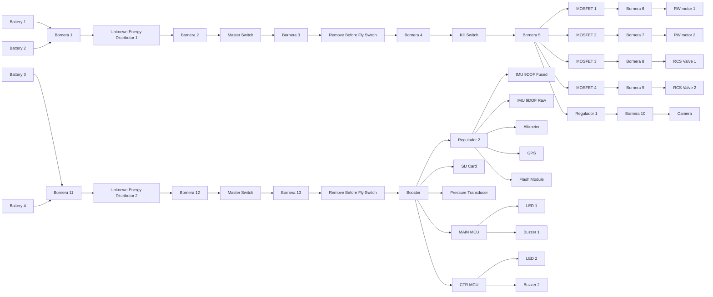

# Electrical Connections, Switches, and Wires

## Purpose of this Document
This document defines part of the proposed final structure system for the CUBESAT for 2026 IREC competition, focusing on electronic safety equipment and cable selection.

## Electronics Safety Equipment
A system with three types of switches is proposed for the electronic structure of the CUBESAT for reasons of safety, versatility, and with the aim of preventing discharges or long system operating times. However, some guidelines should be taken into account.

## Electrical Schematic Diagram 

### Master Switch
This switch is used as redundancy for the rbf switch. If it were not there, the system's power supply would depend on it (RBF), which is very volatile and would pose many risks. It (MASTER) is used for security functions.

### RBF Switch
This switch consists of a removable pin that is inserted and removed through a hole in the fuselage when the CUBESAT is assembled inside the launch vehicle. The pin is inserted, the master switch is turned on, and then the pin is removed from the RBF to energize the computing and sensor area.

### Kill Switch
These switches are located in the actuator area and allow power to pass only when the CUBESAT is ejected from the launch vehicle.

### MOSFETS
These are electronic switches located in each actuator, allowing power to pass or not through signals sent by the MAIN OBC.

## Analysis and Selection of Cables

| ITEM      | Operating Voltage (V) | Total Power Consumption (W) | Operating Consumption (A) | Caliber of Cables (AWG) |
| ------------------------------- | --------------------: | -------------------------: | --------------------------: |--------------------------: |
| RW motors  |    12 |   9.6 |    0.8 | 24-26 |
| Valves     |    12 |   7.7 |    0.6 | 26-28 |
| Camera     |     5 |  9.25 |   1.85 | 22-24 |
| Buzzers    |     5 |  0.25 |   0.05 | 30    |
| Leds       |   3.3 |   0.2 |   0.06 | 30    |
| Tierra     |       |       |        | 22    |

## 1. MAIN OBC: ESP32-S3 DevKit C1

| Categoría | Ítem | Pin (GPIO) |
| :--- | :--- | :--- | 
| **COM** | UART TX (CTR OBC) | **GPIO 43** | 
| **COM** | UART RX (CTR OBC) | **GPIO 44** | 
| **COM** | UART3 TX (GPS) | **GPIO 17** | 
| **COM** | UART3 RX (GPS) | **GPIO 18** | 
| **I2C1** | SDA (Fused Data) | **GPIO 4** | 
| **I2C1** | SCL (Fused Data) | **GPIO 5** | 
| **SPI1** | SCK (Flash/SD) | **GPIO 12** | 
| **SPI1** | MOSI (Flash/SD) | **GPIO 11** | 
| **SPI1** | MISO (Flash/SD) | **GPIO 13** | 
| **CS** | CS Flash | **GPIO 10** | 
| **CS** | CS Micro SD | **GPIO 14** | 
| **SPI2** | SCK (Sensores) | **GPIO 36** | 
| **SPI2** | MOSI (Sensores) | **GPIO 35** | 
| **SPI2** | MISO (Sensores) | **GPIO 37** | 
| **CS** | CS IMU Raw | **GPIO 47** | 
| **CS** | CS Altimeter | **GPIO 48** | 
| **I2C2**| SDA (ADC) | **GPIO 6** | 
| **I2C2**| SCL (ADC) | **GPIO 7** | 
| **COM** | UART2 TX (CAM) | **GPIO 15** | 
| **COM** | UART2 RX (CAM) | **GPIO 16** | 
| **OUTPUT**| Buzzer 1 | **GPIO 2** |
| **OUTPUT**| LEDs | **38, 39, 40**| 

## 2. CTR OBC: TEENSY 4.1

| Categoría | Ítem | Pin |
| :--- | :--- | :--- | 
| **COM** | UART1 TX (MAIN) | **Pin 1** | 
| **COM** | UART1 RX (MAIN) | **Pin 0** | 
| **OUTPUT**| Buzzer 2 | **6** | 
| **OUTPUT**| LEDs | **9, 10, 11** | 